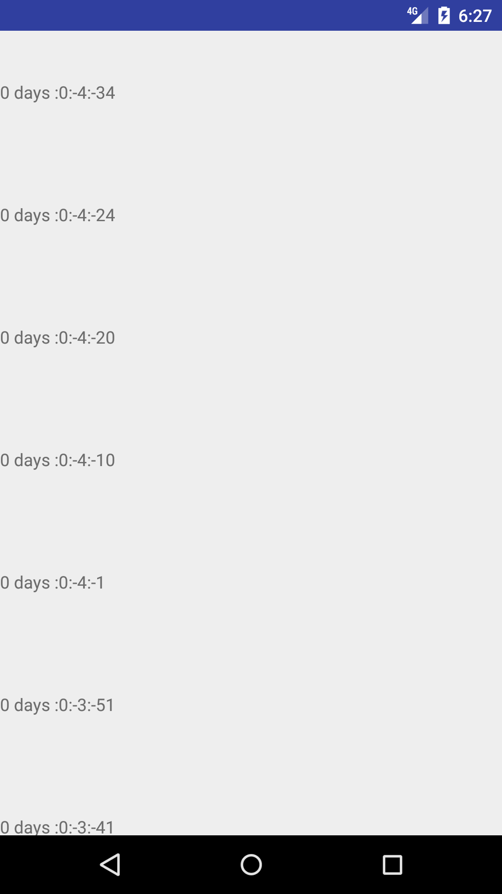
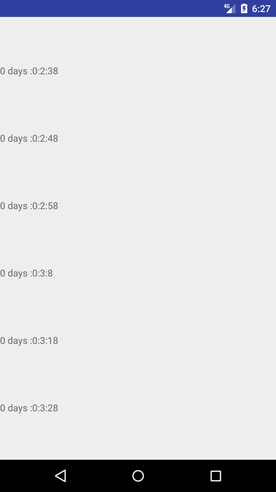

# TimerInRecyclerView
Handling multiple Countdown timers in Recyclerview

Inspired from various SO questions,

[Recyclerview with multiple countdown timers causes flickering] (https://stackoverflow.com/questions/35860780/recyclerview-with-multiple-countdown-timers-causes-flickering)

[Multiple count down timers in RecyclerView flickering when scrolled] (https://stackoverflow.com/questions/38890863/multiple-count-down-timers-in-recyclerview-flickering-when-scrolled)

[How to handle multiple countdown timers in RecyclerView?] (https://stackoverflow.com/questions/32257586/how-to-handle-multiple-countdown-timers-in-recyclerview)

and 
[Handling countdown timers in recyclerview - android] (https://stackoverflow.com/questions/38241539/handling-countdown-timers-in-recyclerview-android)

# Screenshots

# App Performance

# What does this app do?
The aim of the project is to showcase how to handle multiple timer inside the recyclerview and how to clean up the resource.

# How does app do?
Instead of CountdownTimer/TimerTask app performs count down operation using Runnable and handler.

# Reasoning
Motivation of the application is to have individual timer for each row, however recycle the timer as same logic as view recycling,
so that there won't be peak memory usage and leading to impact on performance. 

